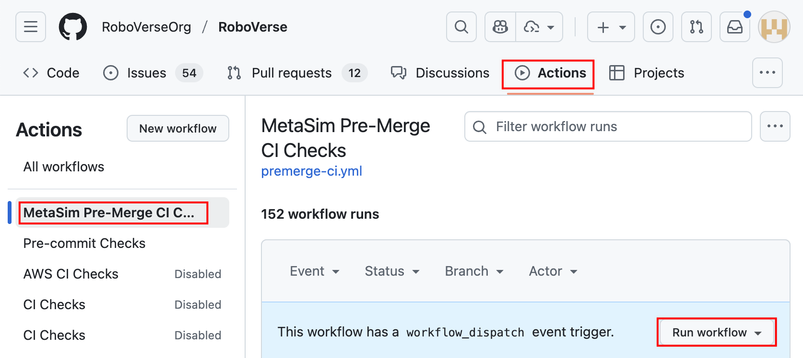

# Auto Testing

## Run test locally

RoboVerse uses pytest for testing.

Every time you should only run the test for one single simulator:
```
pytest -k ${sim}
```

For example, to test the functionality of the isaaclab simulator, you can run:
```
pytest -k isaaclab
```

## Run test in CI

CI is automatically triggered every time a PR is ready to be merged (i.e., added to the [merge queue](https://docs.github.com/en/repositories/configuring-branches-and-merges-in-your-repository/configuring-pull-request-merges/managing-a-merge-queue)).

To launch the CI manually, please refer to [Manually running a workflow](https://docs.github.com/en/actions/how-tos/manage-workflow-runs/manually-run-a-workflow). Specifically, go to Actions tab, select the target workflow, and click the "Run workflow" button, as illustrated below.

