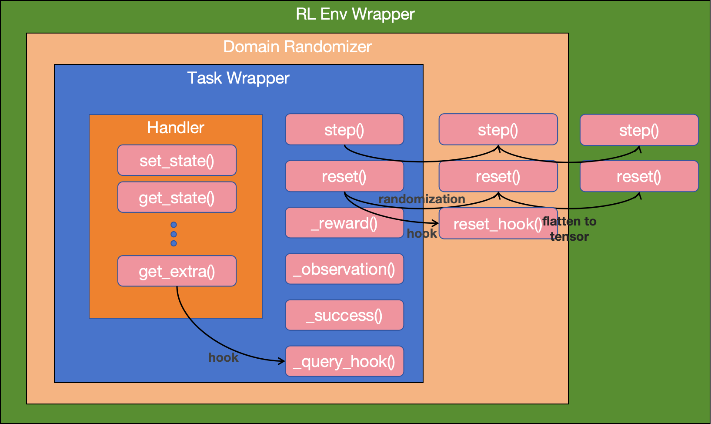

# RoboVerse Achitecture Overview

## 1. Metasim

### 1) Design Philosophy

**Metasim** is a  **unified framework** for simulated environments.

In **Metasim**, we followed the principles of object oriented programming, and used wrapper + hook framework to keep the logic clear and make the framework extendable. We proposed 4 layers of simulations defined in the following figure.

From the core to the shell, we have `Handlers`, whose responsibility is to run the physics simulation with different backends, `Task Wrappers`, who constructs the Gym-like pipeline, `Domain Randomizer`, who plays an improtant role in creating randomized simulation, and `RL Env Wrapper`, which can be added to further specify which observations are used for RL trainings.

**Handlers**: All static contents of a simulation (robots used, objects used, lightings, physics parameters) are defined inside of a configuration system we call `Scenario Config`. Such configs are then instantiated with `Handlers` with different backends (mujoco, isaaclab, etc.).

**Task Wrapper**: `Handlers` are then wrapped in a `Task Wrapper` that provide gym-style APIs to users. Each task wrapper corresponds to a task. A task wrapper is shipped with a default `Scenario Config`, which defines the static scene of the task. Other features realted to the task, including reward function and success reporting, are explicitely implemented in this wrapper for each task.

**Domain Randomizer**: `Domain Randomizer` will be responsible for both static randomizations (object mass, friction, lightings) at reset of the simulation (similar to what you can do in Isaaclab), as well as real-time randomizations that randomizes the observations and actions for each step. The randomizer will wrap the `Task Wrapper` to form a randomized task.

**RL Env Wrapper**: `RL Env Wrapper` are used in some cases when the RL training requires further modification or specifications to the tensor states obtained from the previous layers.

**Metasim**, therefore, is a layered system designed to provide a unified interface to different underlying physics backends. You don't always need the full 4-layer system. You can use it to any level depending on the use case.

<!-- >  Its design principle:
>
> 1. **Metasim is a standalone simulation interface that supports multiple use cases.**
> 2. **Configurations only describe static, simulator-agnostic, simulation-related properties.**
> 3. **New tasks should be easy to migrate or implement from scratch without modifying simulator logic.** -->

------

### 2) Directory Structure in Metasim

Inside the `metasim/` folder:

| Folder/File               | Description                                                  |
| ------------------------- | ------------------------------------------------------------ |
| `cfg/`                    | Contains static py configs that define simulation-related properties — such as robot models, scenes, objects, and task setups. |
| `sim/`                    | Simulator-specific `Handlers`. Each simulator has a handler that defines how to set, step, and get state. |
| `scripts/`                | Includes runnable tools that operate within Metasim  — e.g. trajectory replay, asset conversion. |
| `test/`                   | Contains consistency tests for handler behavior debug. In particular, it ensures information does not change after using `get_state()` and `set_state()` |
| `task/`                   | Defines the base classes of `Task Wrappers` and `RL Env Wrapper` |
| `utils/`                  | Shared utility functions that Metasim uses internally        |
| `constants.py / types.py` | Global definitions for enums and shared constants used throughout the metasim system. |

------

### 3) Core Components

The **two most important folders** in Metasim are:

1. #### sim folder — Simulator Adapters

   The `sim/` module defines simulation-specific handlers that bridge between low-level simulators (like MuJoCo, IsaacGym) and RoboVerse’s unified task interface.

   Each simulator implements a handler class (e.g., `MJXHandler`, `IsaacHandler`) by inheriting from `BaseSimHandler`. These handlers are responsible for loading assets, stepping physics, setting/resetting environment state, and extracting structured state for upper layers.

   ------

2. #### cfg folder — Simulator Configuration

   ##### What Belongs in Config

   Each config file under `cfg/` specifies *only* information required to build and launch the simulation. This includes:

   | Key Section  | Purpose                                                      |
   | ------------ | ------------------------------------------------------------ |
   | `robots`     | List of robot instances, including model path (e.g. MJCF or URDF), initial pose, joint limits, etc. |
   | `objects`    | Static or dynamic scene objects, such as tables, cubes, buttons. Each has position, type, and optional fixations. |
   | `lights`     | Light source settings for visual fidelity or vision-based tasks (e.g. color, direction, intensity). |
   | `cameras`    | Camera positions and intrinsics, e.g., for RGB, depth, or offscreen rendering. |
   | `scene`      | Ground plane, friction, or other high-level environment descriptors. |
   | `sim_params` | Physics timestep, solver config, gravity toggle, etc.        |

   ------

   #####  What Does Not Belong in Config

   To keep `cfg/` clean and portable across tasks and RL settings, the following things are **explicitly excluded**:

   - Reward functions
   - Observation definitions
   - Success checkers
   - Task-level logic or termination conditions
   - Algorithm-specific parameters (policy type, optimizer, etc.)

   > These should all live in upper-level wrappers in Roboverse_learn

   ------

   #####  Integration with ScenarioCfg

   Every handler is initialized with a `ScenarioCfg` object parsed from these configs.
    The `ScenarioCfg` aggregates all static config elements (robot, objects, lights, etc.), and passes them to the simulation backend during launch.

   This decoupling ensures that you can:

   - Reuse one config across multiple RL tasks
   - Load the same config for visualization, trajectory replay, or debugging
   - Build new tasks without touching simulator configs

## 2. RoboVerse Learn

RoboVerse Learn consists of Task Wrappers and Learning Framework.
Its goal is to present *one* standard interface that:

* Lets any algorithm (PPO, SAC, BC, etc.) work with any task
* Hides simulator & task differences, so you can swap tasks, simulators or algorithms with minimal friction

---

### 1) Design Philosophy

| #     | Principle                                | Key Points                                                   |
| ----- | ---------------------------------------- | ------------------------------------------------------------ |
| **1** | **Standardised Wrapper API**             | • `TaskWrapper` exposes `step / reset / _reward / _observation / _success`. • Once an algorithm is connected to a single `TaskWrapper`, it can seamlessly switch to any other task simply by replacing the wrapper. • Upper‑level algorithms need not care whether the backend is MuJoCo, Isaac, etc. |
| **2** | **Minimise Task‑Migration Cost**         | • Add a task: just subclass / compose a wrapper. • Switch simulator: wrappers/algorithms stay unchanged. • Directory layout, Configs management（except the sim-related part）, training scripts all stay the same. |
| **3** | **Reusable Reward & Checker Primitives** | • Tasks build complex logic by *composing* primitives → no copy‑paste across tasks. |

---

### 2) Module Composition

| Sub‑module                        | Responsibilities                                             |
| --------------------------------- | ------------------------------------------------------------ |
| **Task Wrapper (Metasim)**        | • Combines a `Handler` & exposes `step / reset`. • Assembles Reward / Observation / Success . • Provides `pre_sim_step` & `post_sim_step` callbacks for *task‑level* DR. |
| **Handler (Metasim)**             | • `set_state / get_state / get_extras` unified across engines. • *Physics‑level* DR (`pre_sim_step`). • Pure simulator adapter—no algorithm logic. |
| **Learning Framework**            | • Any RL / IL algorithm. • No simulator knowledge.        |
| **Custom Util Wrapper**           | • Provide lightweight extensions (e.g., NumPy-to-Torch conversion, first-frame caching) to support logging, preprocessing, or offline data collection without modifying core task logic. |

---

### 3) Interface List

| Method                        | Purpose                                                      |
| ----------------------------- | ------------------------------------------------------------ |
| `step(action)`                | Runs one simulation step: calls `pre_sim_step`, then `handler.simulate()`, then `post_sim_step`; returns `(obs, reward, done, info)` |
| `reset()`                     | Resets the environment and applies `reset_callback`, returns initial observation |
| `pre_sim_step()`              | (Optional) Hook for task-level domain randomization before simulation |
| `post_sim_step()`             | (Optional) Hook for post-processing (e.g., observation noise) |
| `get_state()` / `set_state()` | Unified simulator-agnostic state interface using `TensorState` |
| `get_extras(spec)`            | Returns task-specific quantities (e.g., site poses, contact forces) via query descriptors |

### 4) Domain Randomisation Layers

| Layer             | Location                      | Examples                                             |
| ----------------- | ----------------------------- | ---------------------------------------------------- |
| **Physics‑level** | `Handler`                     | Friction, mass, light, material                      |
| **Task‑level**    | `Wrapper.pre/post_sim_step()` | Action noise, observation noise, initial‑pose jitter |

*Rule:* Simulator parameters → Handler; task‑coupled noise → Wrapper.

## 3. RoboVerse Pack

RoboVerse Pack provides pre-built implementations of robots, scenes, and tasks that follow Metasim's interfaces and protocols. It serves as a collection of ready-to-use components that users can directly import and use without implementing from scratch.

RoboVerse Pack contains pre-built implementations of robots, scenes, and tasks that follow Metasim's interfaces and protocols. The robots include pre-configured models like Franka Panda, H1 Humanoid, Shadow Hand, Allegro Hand, and Unitree robots, all with proper joint limits, collision meshes, and initial poses. Scenes provide environment layouts with tables, objects, lighting, and camera setups, including manycore scenes, tapwater scenes, and base scene configurations. Tasks offer specific implementations following the Task Wrapper pattern, such as HumanoidBench tasks (crawl), ManiSkill tasks (pick & place, stacking), and RLBench tasks.

